# Example Study Report - Group Sequential Design with Multiple Testing

## Introduction

With a 28-month accrual period, the total sample size planned for the
study is 600.

## Enrollment

- Piece-wise Constant Enrollment Rates
- Cumulative Enrollment

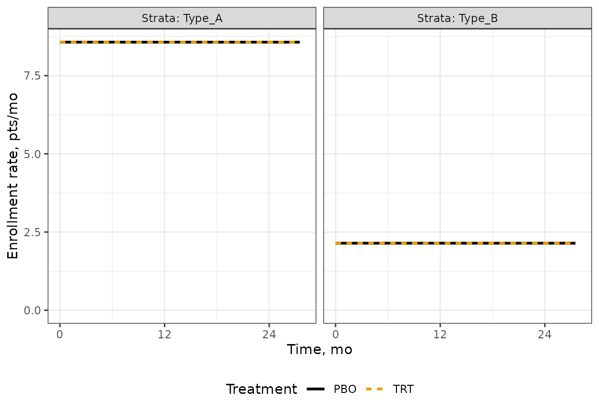

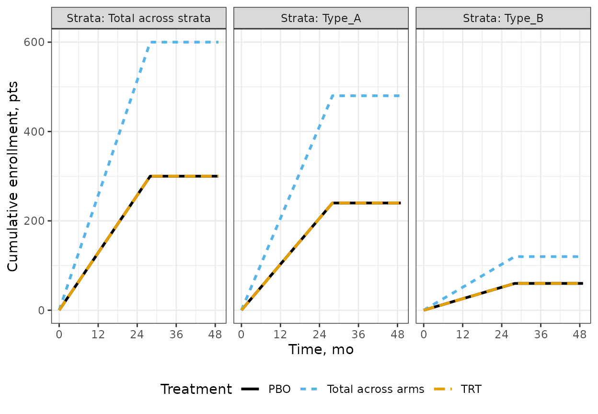

## Multiplicity Adjustment

The multiplicity strategy follows the graphical approach for group
sequential designs of Maurer and Bretz (2013) which provides strong
control of type 1 error. The procedure takes into account both sources
of multiplicity: multiple hypothesis tests (e.g., across primary and
secondary endpoints) and multiple analyses planned for the study (i.e.,
interim and final analyses).

There are two key components that define this approach:

- Testing algorithm for multiple hypotheses specified by the graphical
  representation
- Repeated testing of some hypotheses using the alpha-spending function
  methodology

The multiplicity strategy will be applied to the 3 hypotheses across CR,
OS, EFS endpoints. The following table summarizes the hypotheses
specifying alpha-spending functions (for hypotheses to be tested group
sequentially) together with the effect sizes and planned maximum
statistical information (sample size or number of events).

**Table 1. Summary of Primary and Key Secondary Hypotheses**

|  |  |  |  |  |  |  |
|----|----|----|---:|----|---:|---:|
| Label | Endpoint | Type | Initial weight | GSD spending fn | Effect size\* | Maximum events / sample size |
| H1 | CR | Primary | 0.4 | N/A | Delta = 15% | 500 |
| H2 | OS | Primary | 0.6 | HSD(-1), with a nominal spend of 0.001 at IA1 | HR = 0.69 | 334 |
| H3 | EFS | Secondary | 0 | HSD(-1), with a nominal spend of 0.001 at IA1 | AHR = 0.68 | 413 |
| \*For a hypothesis corresponding to a time-to-event variable subject to non-proportional hazards, the listed effect size is the average hazard ratio at the final analysis of this hypothesis. |  |  |  |  |  |  |

Trial Design Summary {#tab:table1 .table .huxtable
quarto-disable-processing="true"
style="width: 100%; margin-left: auto; margin-right: auto;"}

The overall type I family-wise error rate for 3 hypotheses, over all
(interim and final) analyses, is controlled to 2.5% (one-sided).

## Distribution Assumptions

- Binary Endpoints
- Time-to-Event Endpoints

#### Rates

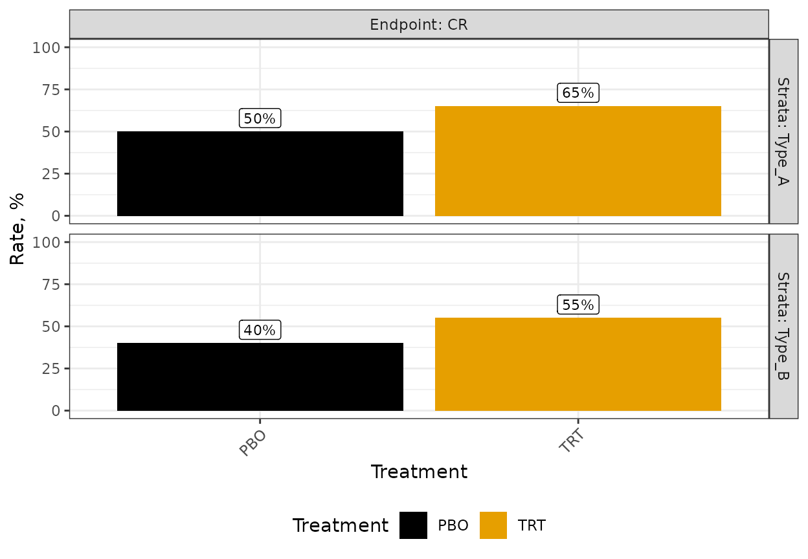

#### Absolute Risk Differences

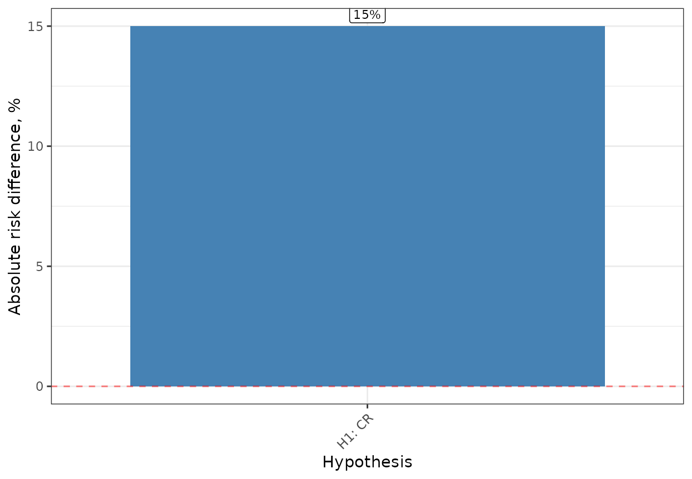

#### Drop-out Rates

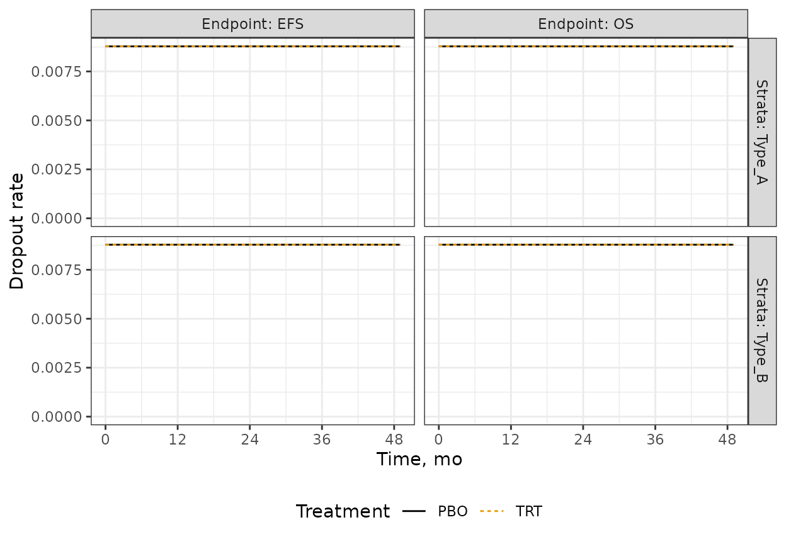

#### Cumulative Drop-out Probabilities

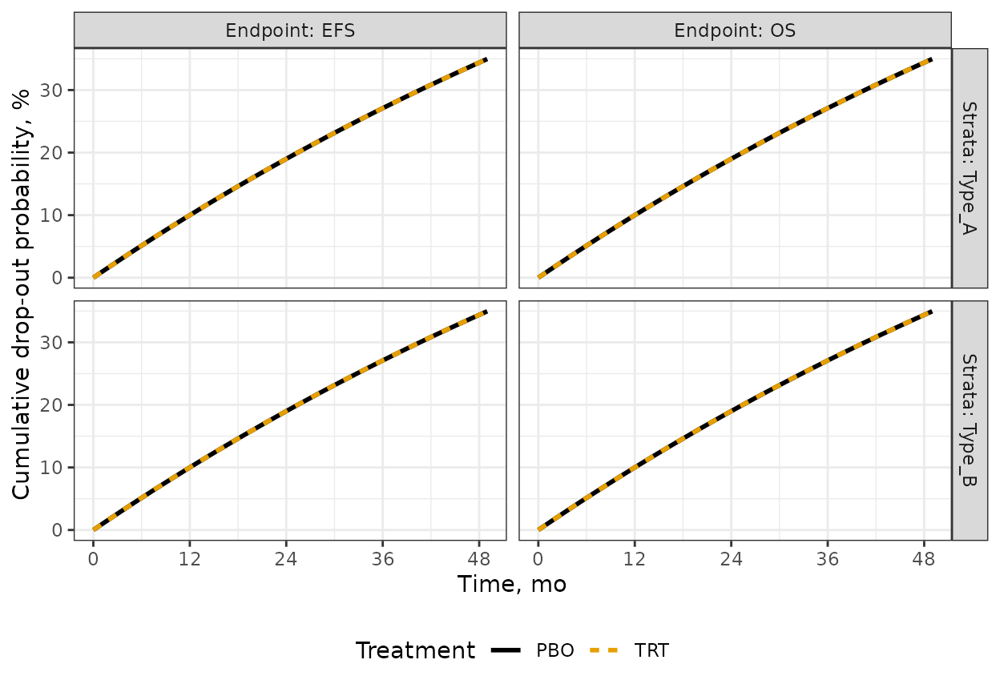

#### Hazard Rate

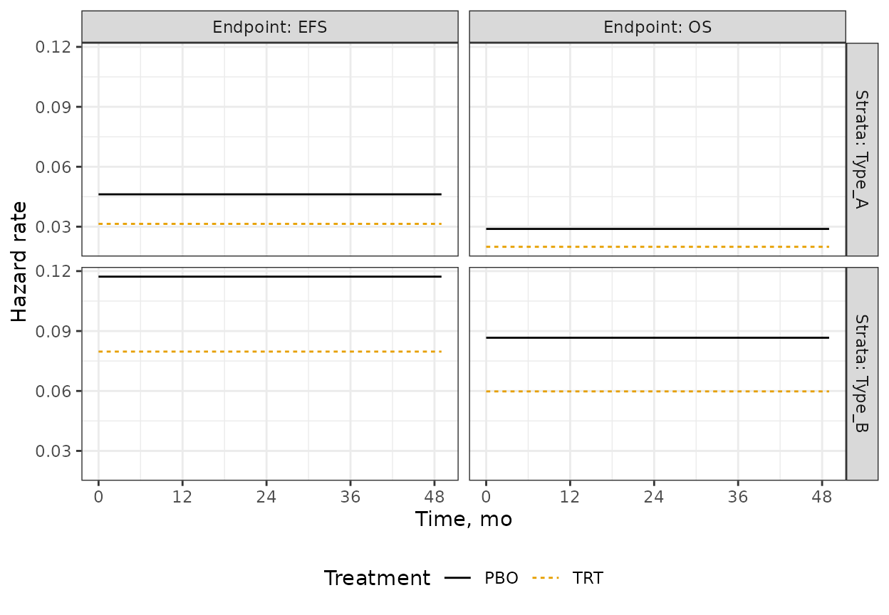

#### Cumulative Hazard

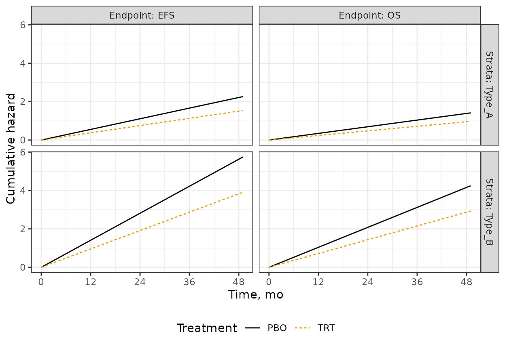

#### Survival Curves

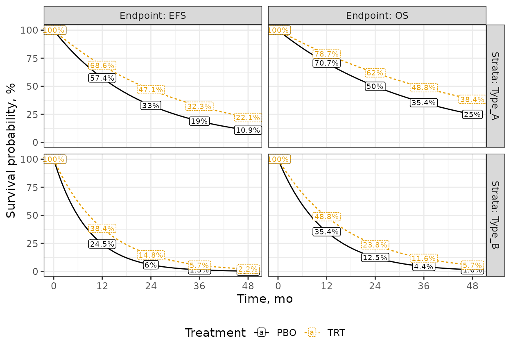

#### Median Survival

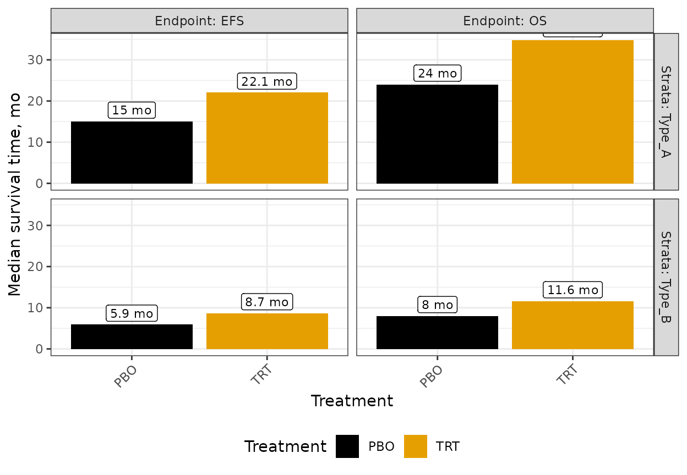

#### Survival Quantiles

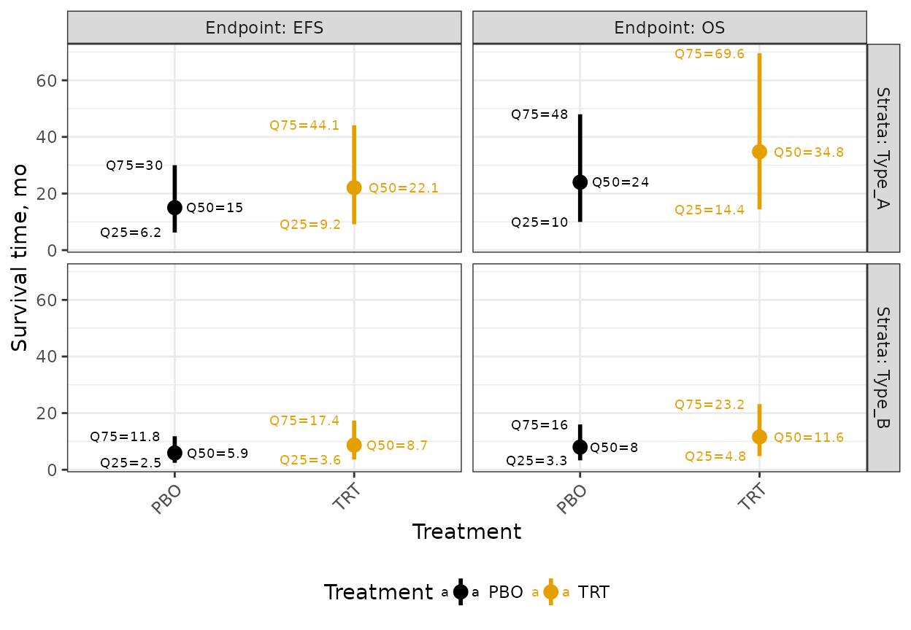

#### Enrollment Weighted Survival Curves

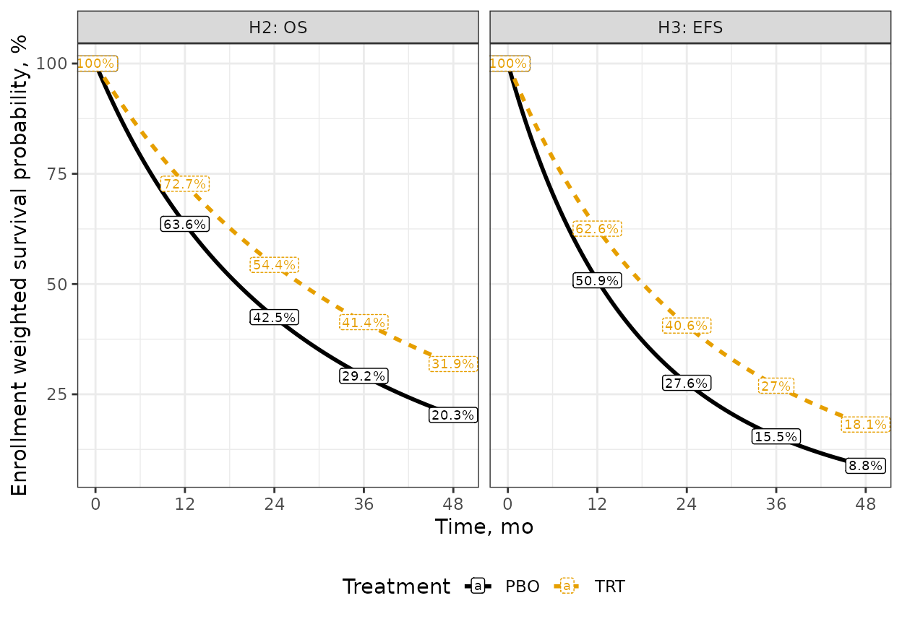

#### Piece-wise Hazard Ratios

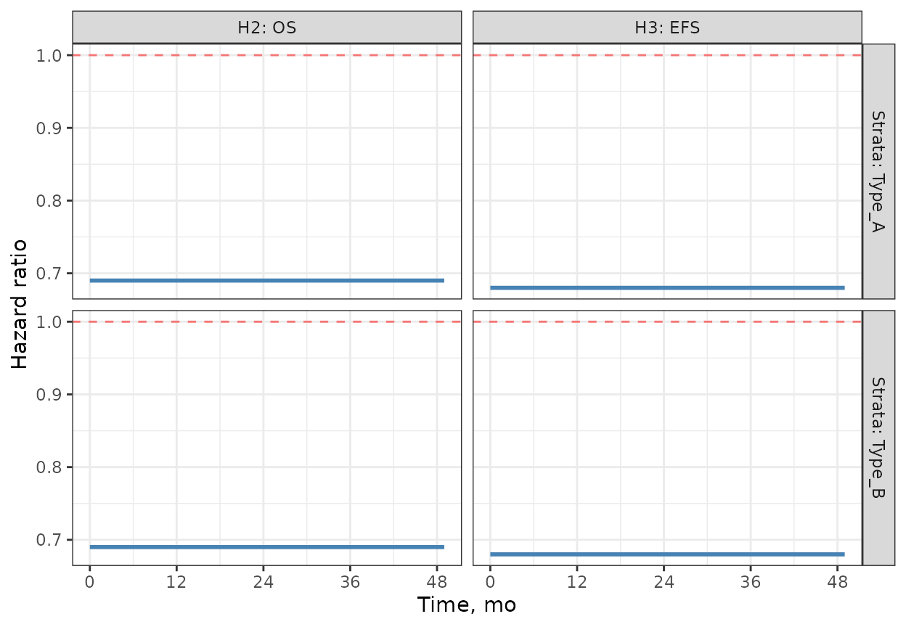

#### Average Hazard Ratios

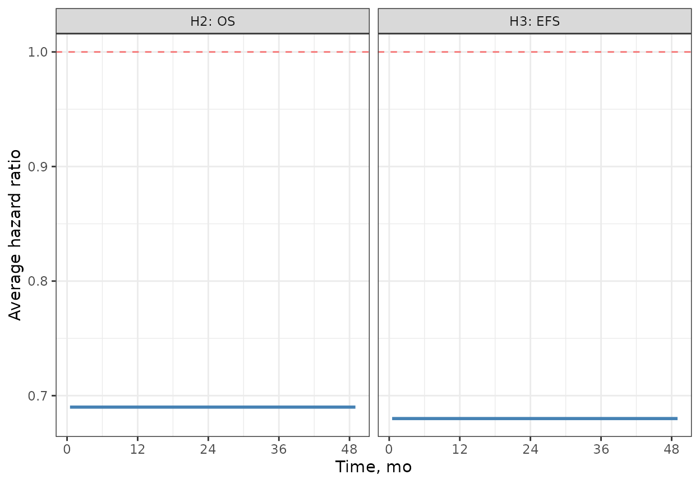

Figure 1 shows the graph where the hypotheses of interest are
represented by the elliptical nodes. Each node has the hypothesis weight
assigned to it (denoted by $`w`$). A particular value of $`w`$ sets the
local significance level associated with that hypothesis (which is equal
to 0.025 × $`w`$). The graphical approach allows local significance
levels to be recycled (along arrows on the graph) when a given
hypothesis is successful (i.e., the corresponding null hypothesis is
rejected) at interim or final analyses.

**Figure 1. Graph Depicting Multiple Hypothesis Testing Strategy**

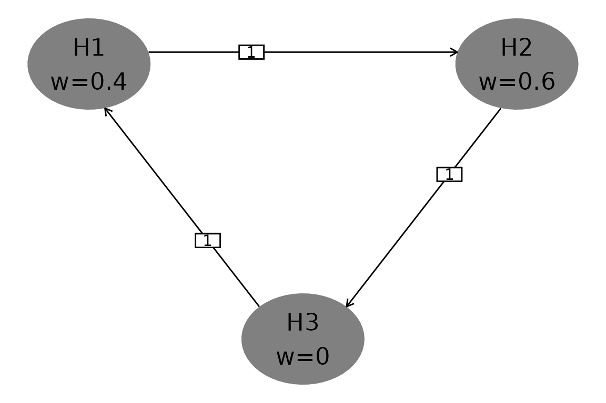

## Interim Analyses

- IA by Hypothesis
- IA by Calendar Time
- Information Flow
- Timeline of Planned Analyses

**Table 2. Summary of Interim Analyses (by hypotheses)**

|  |  |  |  |  |
|----|----|---:|---:|---:|
| Analysis | Criteria for conduct | Events / sample size | Expected analysis time, mo | Information fraction, % |
| H1: CR |  |  |  |  |
| 1 | 500 CR outcomes | 500 | 28.0 | 100.00% |
| H2: OS |  |  |  |  |
| 1 | 500 CR outcomes | 187 | 28.0 | 55.98% |
| 2 | 234 OS events | 234 | 32.8 | 70.06% |
| 3 | 284 OS events | 284 | 39.4 | 85.03% |
| 4 | 334 OS events | 334 | 48.7 | 100.00% |
| H3: EFS |  |  |  |  |
| 1 | 500 CR outcomes | 248 | 28.0 | 60.12% |
| 2 | 234 OS events | 306 | 32.8 | 74.04% |
| 3 | 284 OS events | 362 | 39.4 | 87.70% |
| 4 | 334 OS events | 413 | 48.7 | 100.00% |

Summary of interim analyses by hypothesis {#tab:iaDetailsTableA .table
.huxtable quarto-disable-processing="true"
style="width: 100%; margin-left: auto; margin-right: auto;"}

**Table 3. Summary of Interim Analyses (by calendar analysis)**

|  |  |  |  |
|----|---:|---:|---:|
| Hypothesis | Analysis | Events / sample size | Information fraction, % |
| 500 CR outcomes (Expected analysis time: 28.0 mo) |  |  |  |
| H1: CR | 1 | 500 | 100.00% |
| H2: OS | 1 | 187 | 55.98% |
| H3: EFS | 1 | 248 | 60.12% |
| 234 OS events (Expected analysis time: 32.8 mo) |  |  |  |
| H2: OS | 2 | 234 | 70.06% |
| H3: EFS | 2 | 306 | 74.04% |
| 284 OS events (Expected analysis time: 39.4 mo) |  |  |  |
| H2: OS | 3 | 284 | 85.03% |
| H3: EFS | 3 | 362 | 87.70% |
| 334 OS events (Expected analysis time: 48.7 mo) |  |  |  |
| H2: OS | 4 | 334 | 100.00% |
| H3: EFS | 4 | 413 | 100.00% |

Summary of interim analyses by criteria for conduct
{#tab:iaDetailsTableB .table .huxtable quarto-disable-processing="true"
style="width: 100%; margin-left: auto; margin-right: auto;"}

**Figure 2. Information Factor Over Time by Hypothesis**

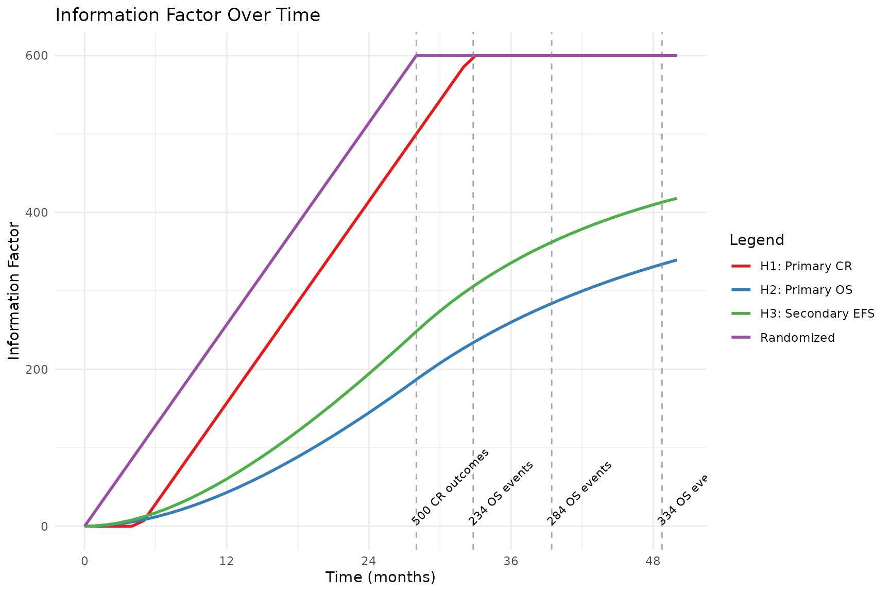

**Figure 3. Anticipated study timeline**

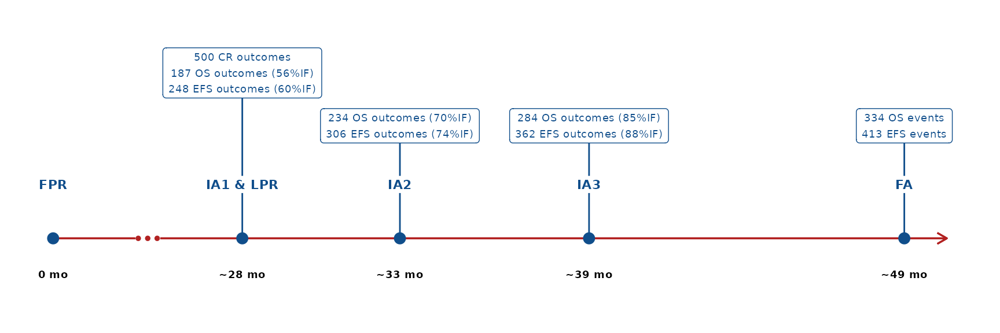

**Figure 3b. Anticipated time of each analysis, with associated
trigger**

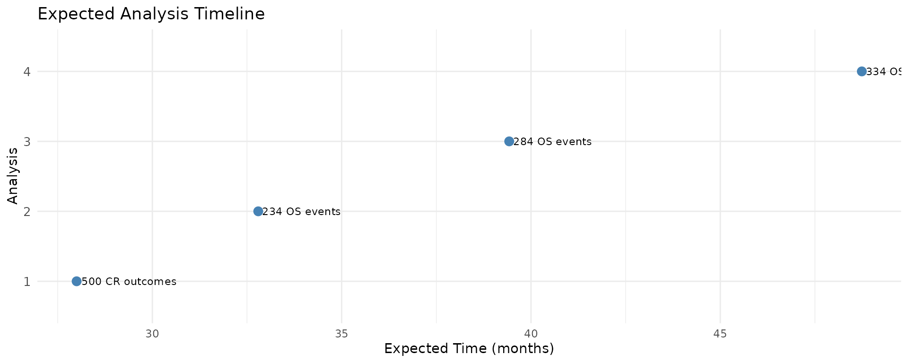

## Hypothesis Testing

- Scenarios
- Boundary Specifications
- Operating Characteristics by Analysis
- Operating Characteristics Overall
- Spending Functions

**Table 4. Weight Allocation Scenarios**

|                   |        |                    |
|------------------:|-------:|--------------------|
| Local alpha level | Weight | Testing scenario   |
|            H1: CR |        |                    |
|           0.01000 |    0.4 | Initial allocation |
|           0.02500 |      1 | Successful H2, H3  |
|            H2: OS |        |                    |
|           0.01500 |    0.6 | Initial allocation |
|           0.02500 |      1 | Successful H1      |
|           H3: EFS |        |                    |
|           0.01500 |    0.6 | Successful H2      |
|           0.02500 |      1 | Successful H1, H2  |

Summary of alpha allocation by hypothesis {#tab:graphTable .table
.huxtable quarto-disable-processing="true"
style="width: 100%; margin-left: auto; margin-right: auto;"}

**Table 5. Boundary Specifications**

Table 5 details the hypothesis testing at the interim and final
analyses. For hypotheses tested group sequentially, the table provides
the nominal p-value boundary derived from the alpha-spending function
and the information fractions. The timing of analyses is expressed in
terms of statistical information fractions. The table also reports local
power at each analysis time.

|  |  |  |  |  |  |
|----|---:|---:|---:|---:|---:|
| Analysis | Local alpha level | Nominal p-value | Exit hurdle | Local power | Information fraction, % |
| H1: CR |  |  |  |  |  |
| 1 | 0.01000 | 0.01000 | 0.104 | 85.551% | 100.00% |
| 1 | 0.02500 | 0.02500 | 0.088 | 92.379% | 100.00% |
| H2: OS |  |  |  |  |  |
| 1 | 0.01500 | 0.00100 | 0.636 | 29.006% | 55.98% |
| 2 | 0.01500 | 0.00876 | 0.733 | 67.903% | 70.06% |
| 3 | 0.01500 | 0.00717 | 0.748 | 78.042% | 85.03% |
| 4 | 0.01500 | 0.00848 | 0.770 | 86.457% | 100.00% |
| 1 | 0.02500 | 0.00100 | 0.636 | 29.006% | 55.98% |
| 2 | 0.02500 | 0.01472 | 0.752 | 74.581% | 70.06% |
| 3 | 0.02500 | 0.01251 | 0.766 | 83.649% | 85.03% |
| 4 | 0.02500 | 0.01493 | 0.788 | 90.600% | 100.00% |
| H3: EFS |  |  |  |  |  |
| 1 | 0.01500 | 0.00100 | 0.676 | 47.933% | 60.12% |
| 2 | 0.01500 | 0.00950 | 0.765 | 84.800% | 74.04% |
| 3 | 0.01500 | 0.00753 | 0.775 | 90.837% | 87.70% |
| 4 | 0.01500 | 0.00832 | 0.790 | 94.775% | 100.00% |
| 1 | 0.02500 | 0.00100 | 0.676 | 47.933% | 60.12% |
| 2 | 0.02500 | 0.01593 | 0.782 | 88.990% | 74.04% |
| 3 | 0.02500 | 0.01314 | 0.792 | 93.805% | 87.70% |
| 4 | 0.02500 | 0.01468 | 0.807 | 96.704% | 100.00% |

Operating characteristics {#tab:grSeqTable .table .huxtable
quarto-disable-processing="true"
style="width: 100%; margin-left: auto; margin-right: auto;"}

**Table 6a. Operating Characteristics at Each Analysis**

|  |  |  |  |
|---:|----|----|---:|
| Analysis | Metric | Hypothesis subset | Probability, % |
| 1 | Power | H1 | 87.500% |
|  |  | H2 | 29.000% |
|  |  | H3 | 14.300% |
|  | Probability of success for at least one Hi | H1, H2 | 90.700% |
|  |  | H1, H2, H3 | 90.700% |
|  | Probability of success for all Hi | H1, H2, H3 | 13.300% |
| 2 | Power | H1 | 89.900% |
|  |  | H2 | 74.200% |
|  |  | H3 | 66.300% |
|  | Probability of success for at least one Hi | H1, H2 | 95.600% |
|  |  | H1, H2, H3 | 95.600% |
|  | Probability of success for all Hi | H1, H2, H3 | 62.200% |
| 3 | Power | H1 | 90.700% |
|  |  | H2 | 84.200% |
|  |  | H3 | 78.800% |
|  | Probability of success for at least one Hi | H1, H2 | 96.900% |
|  |  | H1, H2, H3 | 96.900% |
|  | Probability of success for all Hi | H1, H2, H3 | 73.600% |
| 4 | Power | H1 | 91.900% |
|  |  | H2 | 91.000% |
|  |  | H3 | 87.400% |
|  | Probability of success for at least one Hi | H1, H2 | 98.600% |
|  |  | H1, H2, H3 | 98.600% |
|  | Probability of success for all Hi | H1, H2, H3 | 81.200% |

Operating characteristics by analysis {#tab:operatingCharByAnalysis
.table .huxtable quarto-disable-processing="true"
style="width: 100%; margin-left: auto; margin-right: auto;"}

**Table 6b. Operating Characteristics Across Analyses**

|                                             |                   |       |
|---------------------------------------------|-------------------|------:|
| Metric                                      | Hypothesis subset | Value |
| Expected Success Analysis                   | H1                |  1.08 |
|                                             | H2                |  1.94 |
|                                             | H3                |  2.18 |
| Expected Success Analysis (at least one Hi) | H1, H2            |  1.13 |
|                                             | H1, H2, H3        |  1.13 |
| Expected Success Analysis (for all Hi)      | H1, H2, H3        |  2.16 |
| Expected Success Time                       | H1                |  28.5 |
|                                             | H2                |  33.2 |
|                                             | H3                |  34.5 |
| Expected Success Time (at least one Hi)     | H1, H2            |  28.7 |
|                                             | H1, H2, H3        |  28.7 |
| Expected Success Time (for all Hi)          | H1, H2, H3        |  34.4 |

Operating characteristics across analyses
{#tab:operatingCharAcrossAnalyses .table .huxtable
quarto-disable-processing="true"
style="width: 100%; margin-left: auto; margin-right: auto;"}

**Figure 4. Alpha-spending functions**

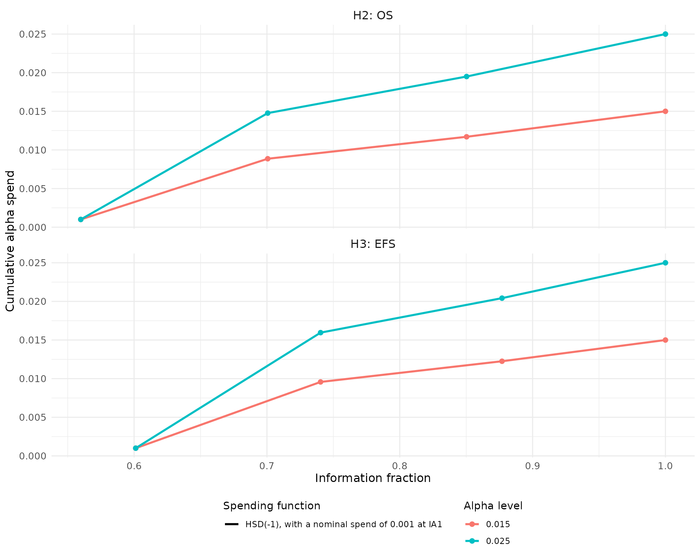

## Configuration Details

### Graph Structure

**Table 7. Transition Matrix**

|     |     |     |
|----:|----:|----:|
|   0 |   1 |   0 |
|   0 |   0 |   1 |
|   1 |   0 |   0 |

**Initial Weights:** 0.4, 0.6, 0

### Enrollment Assumptions

**Table 8. Enrollment Rate Assumptions**

| stratum | treatments |  rate | duration | ratio |
|:--------|:-----------|------:|---------:|:------|
| Type_A  | PBO, TRT   | 17.14 |       28 | 1, 1  |
| Type_B  | PBO, TRT   |  4.29 |       28 | 1, 1  |

### Binary Endpoint Assumptions

**Table 9. Binary Endpoint Parameters**

| endpoint | stratum | treatment | rate | maturity_time |
|:---------|:--------|:----------|-----:|--------------:|
| CR       | Type_A  | PBO       | 0.50 |         4.667 |
| CR       | Type_B  | PBO       | 0.40 |         4.667 |
| CR       | Type_A  | TRT       | 0.65 |         4.667 |
| CR       | Type_B  | TRT       | 0.55 |         4.667 |

### Time-to-Event Endpoint Assumptions

**Table 10. Time-to-Event Distribution Parameters**

| endpoint | stratum | treatment | duration | fail_rate | dropout_rate |
|:---------|:--------|:----------|---------:|----------:|-------------:|
| EFS      | Type_A  | PBO       |      Inf |    0.0462 |       0.0088 |
| EFS      | Type_B  | PBO       |      Inf |    0.1172 |       0.0088 |
| EFS      | Type_A  | TRT       |      Inf |    0.0314 |       0.0088 |
| EFS      | Type_B  | TRT       |      Inf |    0.0797 |       0.0088 |
| OS       | Type_A  | PBO       |      Inf |    0.0289 |       0.0088 |
| OS       | Type_B  | PBO       |      Inf |    0.0866 |       0.0088 |
| OS       | Type_A  | TRT       |      Inf |    0.0199 |       0.0088 |
| OS       | Type_B  | TRT       |      Inf |    0.0598 |       0.0088 |

## References

Maurer W, Bretz F. Multiple testing in group sequential trials using
graphical approaches. *Statistics in Biopharmaceutical Research.*
2013;5(4):311-320.

------------------------------------------------------------------------

*Report generated on 2026-08-14 11:56:38.595907*
