# Platform Trial with Arm Added Midway

## Introduction

This vignette demonstrates how `appendMCP` handles a **platform-type
group sequential design** in which a new treatment arm is added midway
through an ongoing trial. The design pattern illustrated here extends
the standard two-arm group sequential framework described in the
`example_study_report` vignette to accommodate:

- A **3-arm structure** (TrtA monotherapy, TrtAB combination, Control)
  where TrtAB is added after the trial has already started enrolling
  TrtA vs Control;
- A **biomarker stratification** (B+ / B−) that is a genuine patient
  subgroup of clinical interest;
- **Two control-arm pooling strategies** — pooled and concurrent — for
  the TrtAB vs Control comparison;
- A **large graphical multiple testing procedure** spanning 12
  hypotheses across 5 endpoints.

Five families of hypotheses are evaluated in parallel within a single
run. Hence, 5×α was used (with alpha initially distributed among the
families). Each family allows alpha reallocation within its own set of
hypotheses, but not across families. The total one-sided type I error
rate of 12.5% is distributed across 5 families (each starting with its
primary hypothesis) with an initial weight of 0.2.

## Study Design

### Two-Part Enrollment

The trial enrolls in two parts:

- **Part 1** — TrtA vs Control (2:1 ratio), B+/B− stratified, over
  approximately 14 months.
- **Part 2** — TrtAB arm opens. All three arms enroll (TrtA : Control :
  TrtAB = 1:1:4 ratio). B+/B− stratification continues.

The total accrual period is 22 months.

### The Four-Stratum Structure

`appendMCP` uses a **stratum** field to define subpopulations for
enrollment and event modeling. This study uses 4 strata that encode two
independent dimensions simultaneously:

| Stratum   | Enrollment stage            | Biomarker |
|-----------|-----------------------------|-----------|
| `S1_Bpos` | Part 1 (before TrtAB opens) | B+        |
| `S1_Bneg` | Part 1 (before TrtAB opens) | B−        |
| `S2_Bpos` | Part 2 (after TrtAB opens)  | B+        |
| `S2_Bneg` | Part 2 (after TrtAB opens)  | B−        |

The S1/S2 dimension is introduced to track which patients were enrolled
before vs after the TrtAB arm opened. The B+/B− dimension is a
stratification factor that defines a subgroup of clinical interest (see
H12).

### Encoding “Arm Added Midway” via Zero Enrollment Rates

The platform design is encoded in the `enroll_rate` table using
**zero-rate placeholder rows**. S2 strata have rate = 0 during Part 1
(months 0–14), signaling that no S2 patients exist yet. S1 strata have
no rows after Part 1, so their enrollment stops when Part 1 ends.

| stratum | treatments            | rate | duration | ratio   |
|:--------|:----------------------|-----:|---------:|:--------|
| S1_Bpos | TrtA , Control        | 13.2 |        6 | 2, 1    |
| S1_Bneg | TrtA , Control        | 19.8 |        6 | 2, 1    |
| S1_Bpos | TrtA , Control        | 23.2 |        8 | 2, 1    |
| S1_Bneg | TrtA , Control        | 34.8 |        8 | 2, 1    |
| S2_Bpos | TrtA , Control, TrtAB |  0.0 |        6 | 1, 1, 4 |
| S2_Bneg | TrtA , Control, TrtAB |  0.0 |        6 | 1, 1, 4 |
| S2_Bpos | TrtA , Control, TrtAB |  0.0 |        8 | 1, 1, 4 |
| S2_Bneg | TrtA , Control, TrtAB |  0.0 |        8 | 1, 1, 4 |
| S2_Bpos | TrtA , Control, TrtAB | 15.0 |        8 | 1, 1, 4 |
| S2_Bneg | TrtA , Control, TrtAB | 22.5 |        8 | 1, 1, 4 |

Enrollment rate specification. S2 rows with rate = 0 are required
placeholders during Part 1. {.table}

The enrollment curves below show the resulting piecewise accrual by arm
and stage.

## Enrollment

- Piece-wise Constant Enrollment Rates
- Cumulative Enrollment

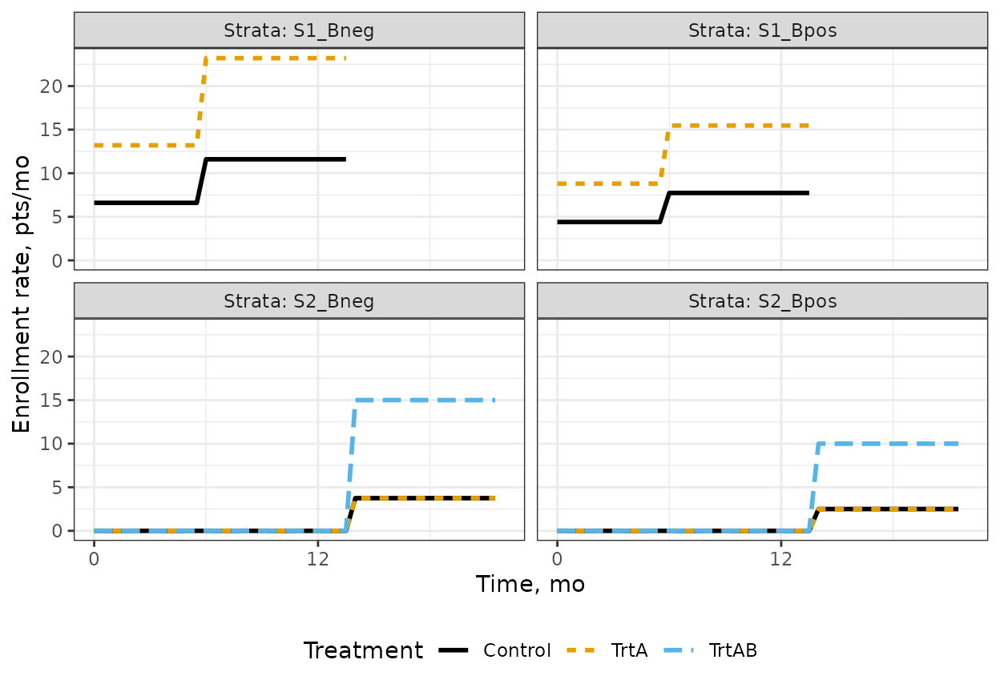

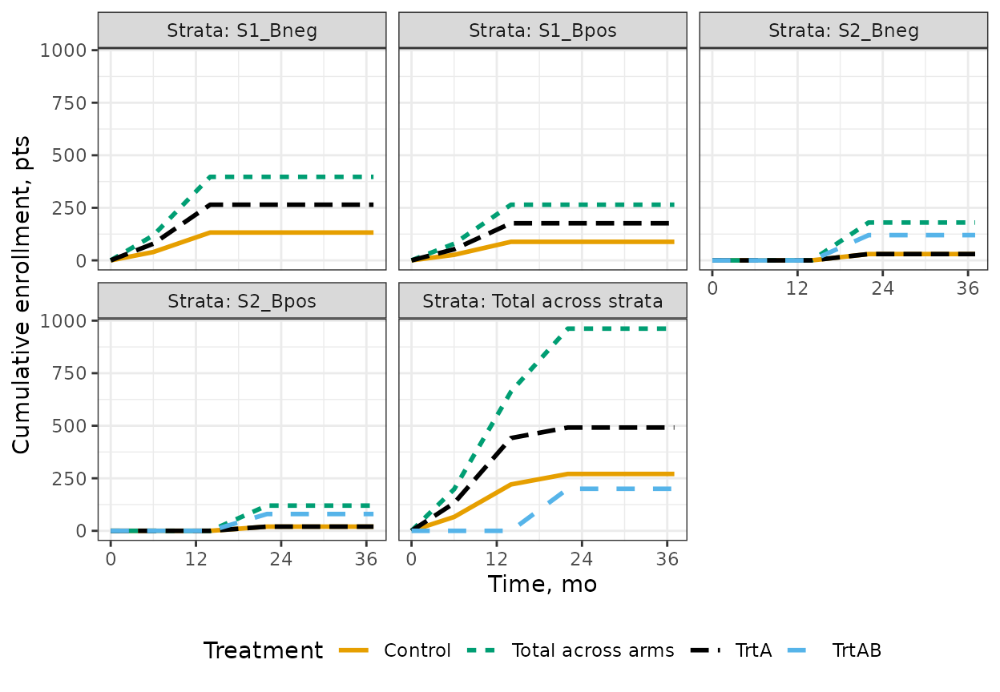

## Multiplicity Adjustment

The multiplicity strategy follows the graphical approach of Maurer and
Bretz (2013), controlling the family-wise type I error rate across both
multiple hypotheses and multiple analyses.

The 12 hypotheses span OS, PFS, EFS, TSP, TTE endpoints.

The following table provides a descriptive summary of each hypothesis
for the reader’s convenience. (This table is specific to this vignette;
in a formal report, abbreviated information could be captured in the
Label column of Table 1.)

| Hypothesis | Endpoint | Comparison       | Population       | Family |
|:-----------|:---------|:-----------------|:-----------------|-------:|
| H1         | OS       | TrtA vs Control  | S1 (Part 1 only) |      1 |
| H2         | PFS      | TrtA vs Control  | S1 (Part 1 only) |      1 |
| H3         | OS       | TrtAB vs Control | S1+S2 (pooled)   |      2 |
| H4         | EFS      | TrtAB vs Control | S1+S2 (pooled)   |      2 |
| H5         | PFS      | TrtAB vs Control | S1+S2 (pooled)   |      2 |
| H6         | TSP      | TrtAB vs Control | S1+S2 (pooled)   |      2 |
| H7         | TTE      | TrtAB vs Control | S1+S2 (pooled)   |      2 |
| H8         | OS       | TrtAB vs Control | S2 (concurrent)  |      3 |
| H9         | PFS      | TrtAB vs Control | S2 (concurrent)  |      3 |
| H10        | OS       | TrtAB vs TrtA    | S1+S2 (pooled)   |      4 |
| H11        | PFS      | TrtAB vs TrtA    | S1+S2 (pooled)   |      4 |
| H12        | OS       | TrtAB vs Control | B+ subgroup only |      5 |

Descriptive summary of hypotheses H1–H12. {.table}

The following table summarizes the hypotheses with their alpha-spending
functions and maximum statistical information.

**Table 1. Summary of Hypotheses**

|  |  |  |  |  |  |  |
|----|----|----|---:|----|---:|---:|
| Label | Endpoint | Type | Initial weight | GSD spending fn | Effect size\* | Maximum events / sample size |
| H1 | OS | Primary | 0.2 | KDM(2.5) | HR = 0.72 | 444 |
| H2 | PFS | Secondary | 0 | N/A | HR = 0.57 | 475 |
| H3 | OS | Primary | 0.2 | KDM(2.5) | HR = 0.62 | 330 |
| H4 | EFS | Secondary | 0 | N/A | HR = 0.35 | 373 |
| H5 | PFS | Secondary | 0 | N/A | HR = 0.4 | 346 |
| H6 | TSP | Secondary | 0 | KDM(2) | HR = 0.55 | 377 |
| H7 | TTE | Secondary | 0 | KDM(2) | HR = 0.47 | 348 |
| H8 | OS | Primary | 0.2 | KDM(2.5) | HR = 0.62 | 148 |
| H9 | PFS | Secondary | 0 | KDM(2.5) | HR = 0.4 | 184 |
| H10 | OS | Primary | 0.2 | KDM(2.5) | HR = 0.861 | 465 |
| H11 | PFS | Secondary | 0 | KDM(2.5) | HR = 0.702 | 565 |
| H12 | OS | Primary | 0.2 | N/A | HR = 0.62 | 132 |
| \*For a hypothesis corresponding to a time-to-event variable subject to non-proportional hazards, the listed effect size is the average hazard ratio at the final analysis of this hypothesis. |  |  |  |  |  |  |

Trial Design Summary {#tab:table1 .table .huxtable
quarto-disable-processing="true"
style="width: 100%; margin-left: auto; margin-right: auto;"}

### Pooled vs Concurrent Control

For the TrtAB vs Control comparison, two separate sets of hypotheses are
pre-specified:

- **Pooled** (H3–H7): Control arm patients from both Part 1 and Part 2
  are combined. This maximizes power but assumes no stage effect on the
  control arm.
- **Concurrent** (H8–H9): Only control arm patients enrolled
  concurrently with TrtAB (Part 2, S2 strata) are used. This is
  conservative but robust to a potential stage effect.

Both strategies are included in the graphical testing procedure, with
alpha propagating between them upon rejection.

### Alpha Distribution

The overall family-wise type I error rate is controlled at 2.5%
(one-sided) per primary hypothesis. The `alpha = 0.025 × 5` setting in
the config reflects the five families evaluated in parallel. Each family
receives initial weight 0.2, giving it a significance level of 0.025.
Alpha can be reallocated within a family upon rejection, but not across
families.

**Figure 1. Graphical Multiple Testing Procedure**

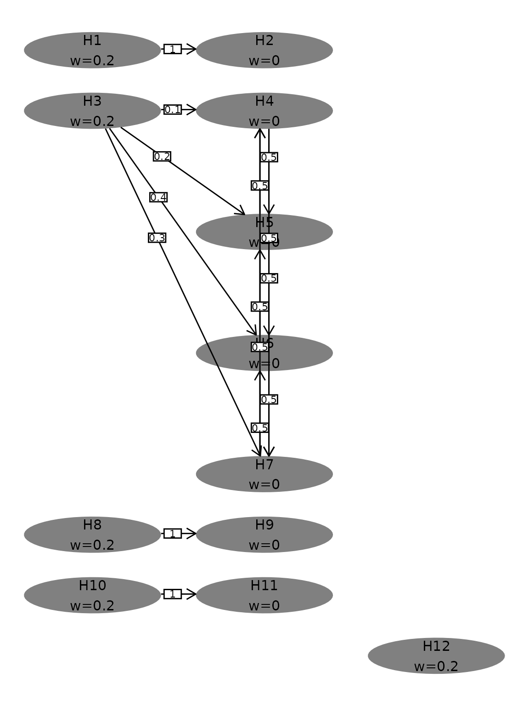

## Interim Analyses

Three event-driven analyses are planned:

1.  **IA1** — 333 OS events in S1 strata (TrtA vs Control)
2.  **IA2** — 444 OS events in S1 strata (TrtA vs Control, final for
    Part 1) and first look at TrtAB vs Control
3.  **FA** — 330 OS events in S1+S2 strata (TrtAB vs Control, final)

- IA by Hypothesis
- IA by Calendar Time
- Information Timeline
- Timeline: Overall
- Timeline: Triggers
- Spending Functions

**Table 2. Summary of Interim Analyses (by hypothesis)**

|  |  |  |  |  |
|----|----|---:|---:|---:|
| Analysis | Criteria for conduct | Events / sample size | Expected analysis time, mo | Information fraction, % |
| H1: OS |  |  |  |  |
| 1 | 333 OS events | 333 | 20.5 | 75.0% |
| 2 | 444 OS events | 444 | 29.0 | 100.0% |
| H2: PFS |  |  |  |  |
| 1 | 333 OS events | 475 | 20.5 | 100.0% |
| H3: OS |  |  |  |  |
| 2 | 444 OS events | 269 | 29.0 | 81.5% |
| 3 | 330 OS events | 330 | 37.5 | 100.0% |
| H4: EFS |  |  |  |  |
| 2 | 444 OS events | 373 | 29.0 | 100.0% |
| H5: PFS |  |  |  |  |
| 2 | 444 OS events | 346 | 29.0 | 100.0% |
| H6: TSP |  |  |  |  |
| 2 | 444 OS events | 323 | 29.0 | 85.5% |
| 3 | 330 OS events | 377 | 37.5 | 100.0% |
| H7: TTE |  |  |  |  |
| 2 | 444 OS events | 292 | 29.0 | 83.9% |
| 3 | 330 OS events | 348 | 37.5 | 100.0% |
| H8: OS |  |  |  |  |
| 2 | 444 OS events | 105 | 29.0 | 70.6% |
| 3 | 330 OS events | 148 | 37.5 | 100.0% |
| H9: PFS |  |  |  |  |
| 2 | 444 OS events | 142 | 29.0 | 77.1% |
| 3 | 330 OS events | 184 | 37.5 | 100.0% |
| H10: OS |  |  |  |  |
| 2 | 444 OS events | 379 | 29.0 | 81.6% |
| 3 | 330 OS events | 465 | 37.5 | 100.0% |
| H11: PFS |  |  |  |  |
| 2 | 444 OS events | 493 | 29.0 | 87.2% |
| 3 | 330 OS events | 565 | 37.5 | 100.0% |
| H12: OS |  |  |  |  |
| 3 | 330 OS events | 132 | 37.5 | 100.0% |

Summary of interim analyses by hypothesis {#tab:iaDetailsTableA .table
.huxtable quarto-disable-processing="true"
style="width: 100%; margin-left: auto; margin-right: auto;"}

**Table 3. Summary of Interim Analyses (by calendar analysis)**

|  |  |  |  |
|----|---:|---:|---:|
| Hypothesis | Analysis | Events / sample size | Information fraction, % |
| 333 OS events (Expected analysis time: 20.5 mo) |  |  |  |
| H1: OS | 1 | 333 | 75.0% |
| H2: PFS | 1 | 475 | 100.0% |
| 444 OS events (Expected analysis time: 29.0 mo) |  |  |  |
| H1: OS | 2 | 444 | 100.0% |
| H3: OS | 2 | 269 | 81.5% |
| H4: EFS | 2 | 373 | 100.0% |
| H5: PFS | 2 | 346 | 100.0% |
| H6: TSP | 2 | 323 | 85.5% |
| H7: TTE | 2 | 292 | 83.9% |
| H8: OS | 2 | 105 | 70.6% |
| H9: PFS | 2 | 142 | 77.1% |
| H10: OS | 2 | 379 | 81.6% |
| H11: PFS | 2 | 493 | 87.2% |
| 330 OS events (Expected analysis time: 37.5 mo) |  |  |  |
| H3: OS | 3 | 330 | 100.0% |
| H6: TSP | 3 | 377 | 100.0% |
| H7: TTE | 3 | 348 | 100.0% |
| H8: OS | 3 | 148 | 100.0% |
| H9: PFS | 3 | 184 | 100.0% |
| H10: OS | 3 | 465 | 100.0% |
| H11: PFS | 3 | 565 | 100.0% |
| H12: OS | 3 | 132 | 100.0% |

Summary of interim analyses by criteria for conduct
{#tab:iaDetailsTableB .table .huxtable quarto-disable-processing="true"
style="width: 100%; margin-left: auto; margin-right: auto;"}

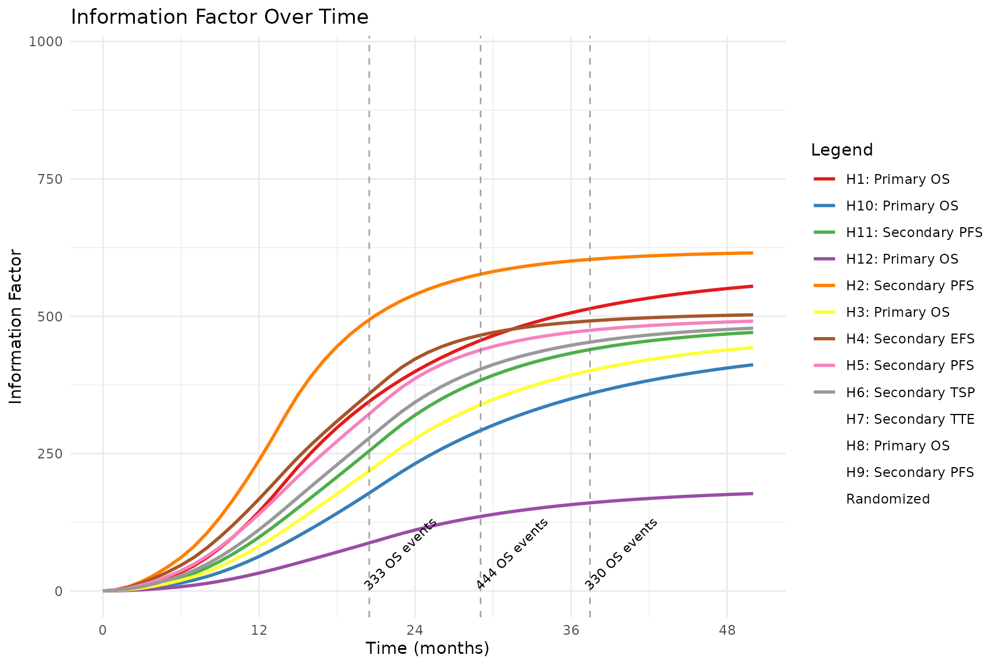

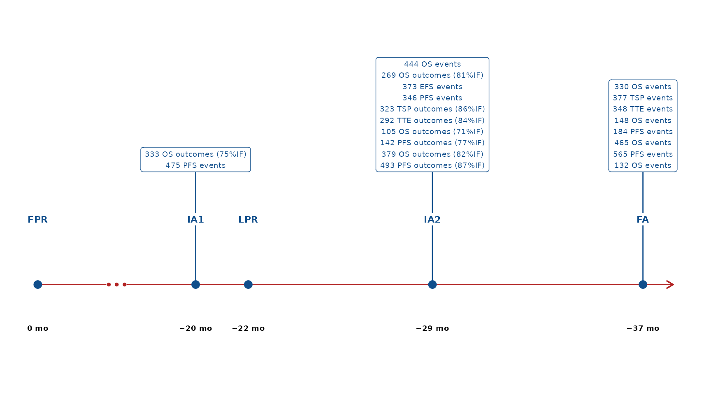

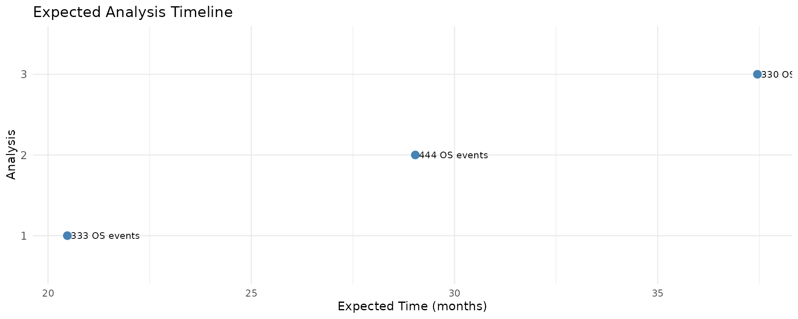

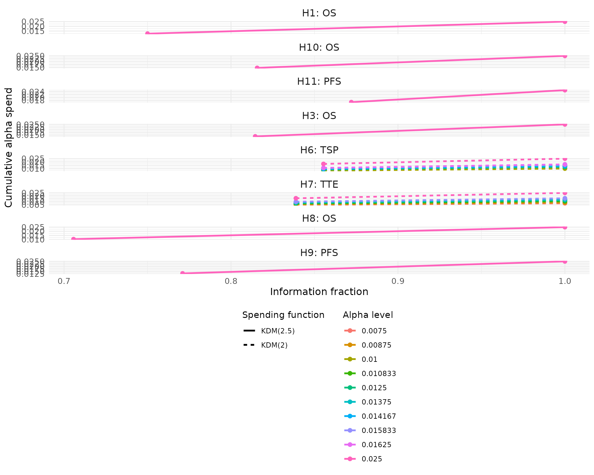

## Hypothesis Testing

- Weight Scenarios
- Boundary Specifications

**Table 4. Weight Allocation Scenarios**

|                   |        |                           |
|------------------:|-------:|---------------------------|
| Local alpha level | Weight | Testing scenario          |
|            H1: OS |        |                           |
|           0.02500 |    0.2 | Initial allocation        |
|           H2: PFS |        |                           |
|           0.02500 |    0.2 | Successful H1             |
|            H3: OS |        |                           |
|           0.02500 |    0.2 | Initial allocation        |
|           H4: EFS |        |                           |
|           0.00250 |   0.02 | Successful H3             |
|           0.00500 |   0.04 | Successful H3, H5         |
|           0.00625 |   0.05 | Successful H3, H7         |
|           0.00875 |   0.07 | Successful H3, H5, H7     |
|           0.00917 | 0.0733 | Successful H3, H5, H6     |
|           0.01083 | 0.0867 | Successful H3, H6, H7     |
|           0.02500 |    0.2 | Successful H3, H5, H6, H7 |
|           H5: PFS |        |                           |
|           0.00500 |   0.04 | Successful H3             |
|           0.00625 |   0.05 | Successful H3, H4         |
|           0.00917 | 0.0733 | Successful H3, H4, H7     |
|           0.01000 |   0.08 | Successful H3, H6         |
|           0.01125 |   0.09 | Successful H3, H4, H6     |
|           0.01417 |  0.113 | Successful H3, H6, H7     |
|           0.02500 |    0.2 | Successful H3, H4, H6, H7 |
|           H6: TSP |        |                           |
|           0.01000 |   0.08 | Successful H3             |
|           0.01250 |    0.1 | Successful H3, H5         |
|           0.01375 |   0.11 | Successful H3, H7         |
|           0.01417 |  0.113 | Successful H3, H4, H5     |
|           0.01583 |  0.127 | Successful H3, H4, H7     |
|           0.01625 |   0.13 | Successful H3, H5, H7     |
|           0.02500 |    0.2 | Successful H3, H4, H5, H7 |
|           H7: TTE |        |                           |
|           0.00750 |   0.06 | Successful H3             |
|           0.00875 |   0.07 | Successful H3, H4         |
|           0.01083 | 0.0867 | Successful H3, H4, H5     |
|           0.01250 |    0.1 | Successful H3, H6         |
|           0.01375 |   0.11 | Successful H3, H4, H6     |
|           0.01583 |  0.127 | Successful H3, H5, H6     |
|           0.02500 |    0.2 | Successful H3, H4, H5, H6 |
|            H8: OS |        |                           |
|           0.02500 |    0.2 | Initial allocation        |
|           H9: PFS |        |                           |
|           0.02500 |    0.2 | Successful H8             |
|           H10: OS |        |                           |
|           0.02500 |    0.2 | Initial allocation        |
|          H11: PFS |        |                           |
|           0.02500 |    0.2 | Successful H10            |
|           H12: OS |        |                           |
|           0.02500 |    0.2 | Initial allocation        |

Summary of alpha allocation by hypothesis {#tab:graphTable .table
.huxtable quarto-disable-processing="true"
style="width: 100%; margin-left: auto; margin-right: auto;"}

**Table 5. Boundary Specifications**

|  |  |  |  |  |  |
|----|---:|---:|---:|---:|---:|
| Analysis | Local alpha level | Nominal p-value | Exit hurdle | Local power | Information fraction, % |
| H1: OS |  |  |  |  |  |
| 1 | 0.02500 | 0.01218 | 0.770 | 71.7% | 75.0% |
| 2 | 0.02500 | 0.02055 | 0.814 | 89.6% | 100.0% |
| H2: PFS |  |  |  |  |  |
| 1 | 0.02500 | 0.02500 | 0.826 | 100.0% | 100.0% |
| H3: OS |  |  |  |  |  |
| 1 | 0.02500 | 0.01378 | 0.701 | 77.7% | 81.5% |
| 2 | 0.02500 | 0.02015 | 0.746 | 90.9% | 100.0% |
| H4: EFS |  |  |  |  |  |
| 1 | 0.00250 | 0.00250 | 0.684 | 100.0% | 100.0% |
| 1 | 0.00500 | 0.00500 | 0.706 | 100.0% | 100.0% |
| 1 | 0.00625 | 0.00625 | 0.713 | 100.0% | 100.0% |
| 1 | 0.00875 | 0.00875 | 0.725 | 100.0% | 100.0% |
| 1 | 0.00917 | 0.00917 | 0.727 | 100.0% | 100.0% |
| 1 | 0.01083 | 0.01083 | 0.733 | 100.0% | 100.0% |
| 1 | 0.02500 | 0.02500 | 0.767 | 100.0% | 100.0% |
| H5: PFS |  |  |  |  |  |
| 1 | 0.00500 | 0.00500 | 0.693 | 100.0% | 100.0% |
| 1 | 0.00625 | 0.00625 | 0.701 | 100.0% | 100.0% |
| 1 | 0.00917 | 0.00917 | 0.715 | 100.0% | 100.0% |
| 1 | 0.01000 | 0.01000 | 0.718 | 100.0% | 100.0% |
| 1 | 0.01125 | 0.01125 | 0.723 | 100.0% | 100.0% |
| 1 | 0.01417 | 0.01417 | 0.732 | 100.0% | 100.0% |
| 1 | 0.02500 | 0.02500 | 0.756 | 100.0% | 100.0% |
| H6: TSP |  |  |  |  |  |
| 1 | 0.01000 | 0.00681 | 0.697 | 94.8% | 85.5% |
| 2 | 0.01000 | 0.00691 | 0.721 | 98.2% | 100.0% |
| 1 | 0.01250 | 0.00851 | 0.706 | 95.6% | 85.5% |
| 2 | 0.01250 | 0.00876 | 0.730 | 98.6% | 100.0% |
| 1 | 0.01375 | 0.00936 | 0.709 | 95.9% | 85.5% |
| 2 | 0.01375 | 0.00970 | 0.733 | 98.7% | 100.0% |
| 1 | 0.01417 | 0.00964 | 0.710 | 96.0% | 85.5% |
| 2 | 0.01417 | 0.01002 | 0.734 | 98.7% | 100.0% |
| 1 | 0.01583 | 0.01078 | 0.715 | 96.4% | 85.5% |
| 2 | 0.01583 | 0.01128 | 0.739 | 98.9% | 100.0% |
| 1 | 0.01625 | 0.01106 | 0.716 | 96.4% | 85.5% |
| 2 | 0.01625 | 0.01160 | 0.740 | 98.9% | 100.0% |
| 1 | 0.02500 | 0.01701 | 0.734 | 97.6% | 85.5% |
| 2 | 0.02500 | 0.01842 | 0.758 | 99.3% | 100.0% |
| H7: TTE |  |  |  |  |  |
| 1 | 0.00750 | 0.00477 | 0.663 | 98.5% | 83.9% |
| 2 | 0.00750 | 0.00517 | 0.696 | 99.8% | 100.0% |
| 1 | 0.00875 | 0.00557 | 0.669 | 98.7% | 83.9% |
| 2 | 0.00875 | 0.00609 | 0.702 | 99.8% | 100.0% |
| 1 | 0.01083 | 0.00690 | 0.677 | 98.9% | 83.9% |
| 2 | 0.01083 | 0.00765 | 0.710 | 99.8% | 100.0% |
| 1 | 0.01250 | 0.00796 | 0.683 | 99.1% | 83.9% |
| 2 | 0.01250 | 0.00891 | 0.715 | 99.9% | 100.0% |
| 1 | 0.01375 | 0.00875 | 0.686 | 99.2% | 83.9% |
| 2 | 0.01375 | 0.00986 | 0.719 | 99.9% | 100.0% |
| 1 | 0.01583 | 0.01008 | 0.692 | 99.3% | 83.9% |
| 2 | 0.01583 | 0.01146 | 0.725 | 99.9% | 100.0% |
| 1 | 0.02500 | 0.01591 | 0.712 | 99.6% | 83.9% |
| 2 | 0.02500 | 0.01867 | 0.745 | 100.0% | 100.0% |
| H8: OS |  |  |  |  |  |
| 1 | 0.02500 | 0.01046 | 0.569 | 36.2% | 70.6% |
| 2 | 0.02500 | 0.02103 | 0.659 | 63.1% | 100.0% |
| H9: PFS |  |  |  |  |  |
| 1 | 0.02500 | 0.01305 | 0.627 | 98.4% | 77.1% |
| 2 | 0.02500 | 0.02033 | 0.686 | 99.8% | 100.0% |
| H10: OS |  |  |  |  |  |
| 1 | 0.02500 | 0.01466 | 0.785 | 20.3% | 81.6% |
| 2 | 0.02500 | 0.01993 | 0.815 | 31.3% | 100.0% |
| H11: PFS |  |  |  |  |  |
| 1 | 0.02500 | 0.01688 | 0.812 | 93.1% | 87.2% |
| 2 | 0.02500 | 0.01944 | 0.829 | 97.0% | 100.0% |
| H12: OS |  |  |  |  |  |
| 1 | 0.02500 | 0.02500 | 0.642 | 56.1% | 100.0% |

Operating characteristics {#tab:grSeqTable .table .huxtable
quarto-disable-processing="true"
style="width: 100%; margin-left: auto; margin-right: auto;"}

## Operating Characteristics

- By Analysis
- Across Analyses

**Table 6a. Operating Characteristics at Each Analysis**

|          |        |                   |                |
|---------:|--------|-------------------|---------------:|
| Analysis | Metric | Hypothesis subset | Probability, % |
|        1 | Power  | H1                |          74.6% |
|          |        | H2                |          74.6% |
|          |        | H3                |           0.0% |
|          |        | H4                |           0.0% |
|          |        | H5                |           0.0% |
|          |        | H6                |           0.0% |
|          |        | H7                |           0.0% |
|          |        | H8                |           0.0% |
|          |        | H9                |           0.0% |
|          |        | H10               |           0.0% |
|          |        | H11               |           0.0% |
|          |        | H12               |           0.0% |
|        2 |        | H1                |          91.5% |
|          |        | H2                |          91.5% |
|          |        | H3                |          87.5% |
|          |        | H4                |          87.5% |
|          |        | H5                |          87.5% |
|          |        | H6                |          86.8% |
|          |        | H7                |          87.5% |
|          |        | H8                |          53.7% |
|          |        | H9                |          53.6% |
|          |        | H10               |          23.8% |
|          |        | H11               |          22.5% |
|          |        | H12               |           0.0% |
|        3 |        | H1                |          91.5% |
|          |        | H2                |          91.5% |
|          |        | H3                |          94.1% |
|          |        | H4                |          94.1% |
|          |        | H5                |          94.1% |
|          |        | H6                |          93.8% |
|          |        | H7                |          94.1% |
|          |        | H8                |          71.3% |
|          |        | H9                |          71.2% |
|          |        | H10               |          32.4% |
|          |        | H11               |          31.5% |
|          |        | H12               |          60.5% |

Operating characteristics by analysis {#tab:operatingCharByAnalysis
.table .huxtable quarto-disable-processing="true"
style="width: 100%; margin-left: auto; margin-right: auto;"}

**Table 6b. Operating Characteristics Across Analyses**

|                           |                   |       |
|---------------------------|-------------------|------:|
| Metric                    | Hypothesis subset | Value |
| Expected Success Analysis | H1                |  1.18 |
|                           | H2                |  1.18 |
|                           | H3                |  2.07 |
|                           | H4                |  2.07 |
|                           | H5                |  2.07 |
|                           | H6                |  2.07 |
|                           | H7                |  2.07 |
|                           | H8                |  2.25 |
|                           | H9                |  2.25 |
|                           | H10               |  2.27 |
|                           | H11               |  2.28 |
|                           | H12               |  3.00 |
| Expected Success Time     | H1                |  22.1 |
|                           | H2                |  22.1 |
|                           | H3                |  29.6 |
|                           | H4                |  29.6 |
|                           | H5                |  29.6 |
|                           | H6                |  29.7 |
|                           | H7                |  29.6 |
|                           | H8                |  31.1 |
|                           | H9                |  31.1 |
|                           | H10               |  31.3 |
|                           | H11               |  31.4 |
|                           | H12               |  37.5 |

Operating characteristics across analyses
{#tab:operatingCharAcrossAnalyses .table .huxtable
quarto-disable-processing="true"
style="width: 100%; margin-left: auto; margin-right: auto;"}

## Distribution Assumptions

- Time-to-Event Endpoints

#### Survival Curves

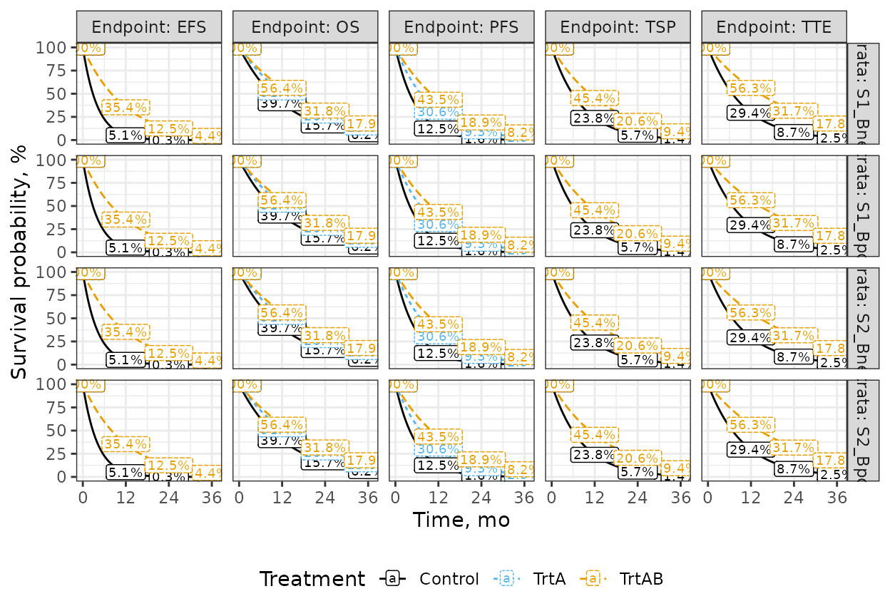

#### Hazard Rates

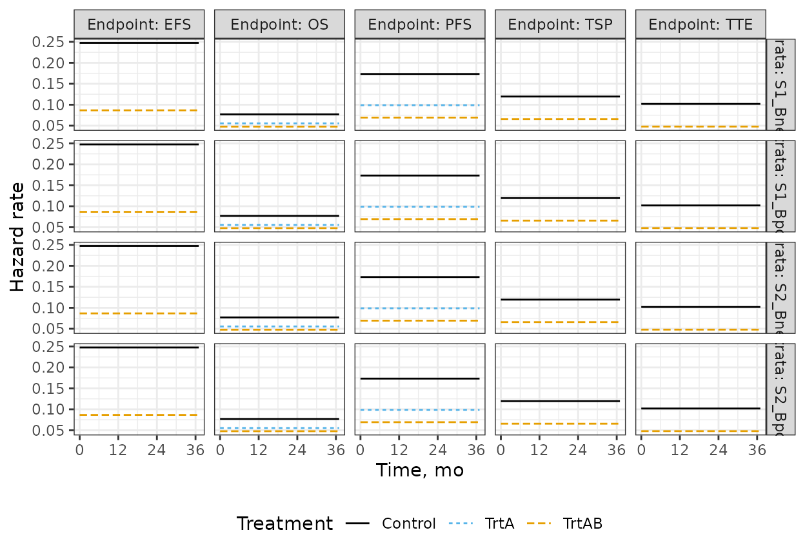

#### Hazard Ratios

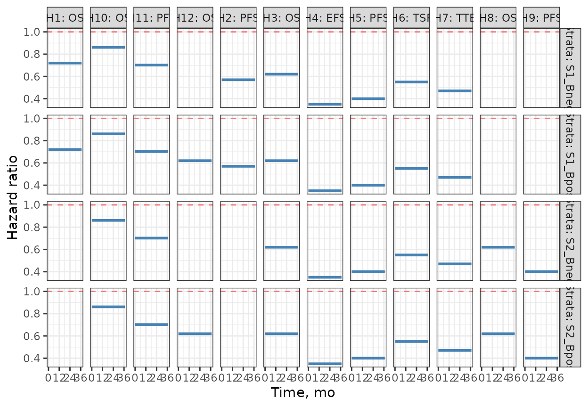

#### Average Hazard Ratios

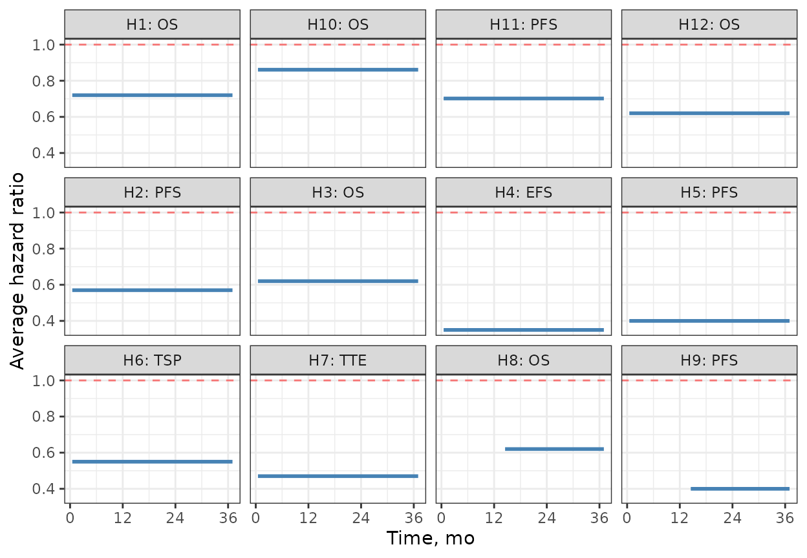

#### Median Survival

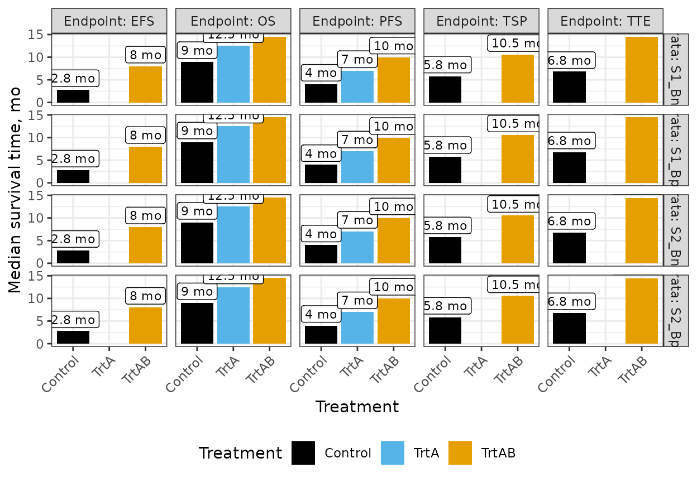

#### Drop-out Rates

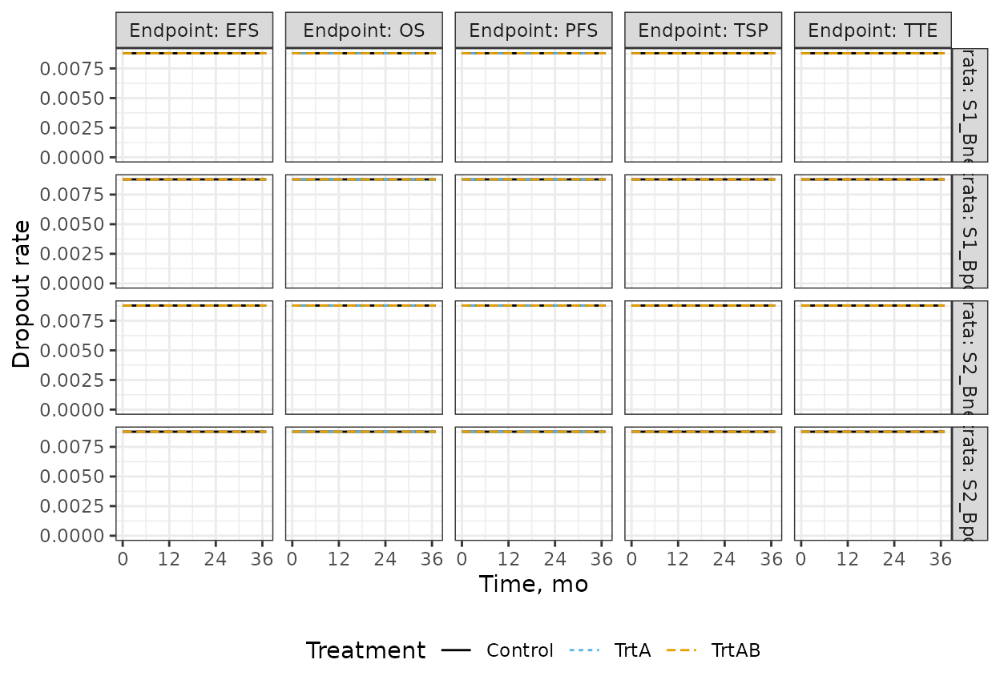

## Input Data

- Enrollment
- Time-to-Event Distributions
- Graph Structure

| stratum | treatments            | rate | duration | ratio   |
|:--------|:----------------------|-----:|---------:|:--------|
| S1_Bpos | TrtA , Control        | 13.2 |        6 | 2, 1    |
| S1_Bneg | TrtA , Control        | 19.8 |        6 | 2, 1    |
| S1_Bpos | TrtA , Control        | 23.2 |        8 | 2, 1    |
| S1_Bneg | TrtA , Control        | 34.8 |        8 | 2, 1    |
| S2_Bpos | TrtA , Control, TrtAB |  0.0 |        6 | 1, 1, 4 |
| S2_Bneg | TrtA , Control, TrtAB |  0.0 |        6 | 1, 1, 4 |
| S2_Bpos | TrtA , Control, TrtAB |  0.0 |        8 | 1, 1, 4 |
| S2_Bneg | TrtA , Control, TrtAB |  0.0 |        8 | 1, 1, 4 |
| S2_Bpos | TrtA , Control, TrtAB | 15.0 |        8 | 1, 1, 4 |
| S2_Bneg | TrtA , Control, TrtAB | 22.5 |        8 | 1, 1, 4 |

Enrollment Rate Assumptions {.table}

| endpoint | stratum | treatment | duration | fail_rate | dropout_rate |
|:---------|:--------|:----------|---------:|----------:|-------------:|
| OS       | S1_Bpos | TrtA      |      Inf |    0.0555 |       0.0088 |
| OS       | S1_Bpos | Control   |      Inf |    0.0770 |       0.0088 |
| OS       | S1_Bneg | TrtA      |      Inf |    0.0555 |       0.0088 |
| OS       | S1_Bneg | Control   |      Inf |    0.0770 |       0.0088 |
| OS       | S2_Bpos | TrtA      |      Inf |    0.0555 |       0.0088 |
| OS       | S2_Bpos | Control   |      Inf |    0.0770 |       0.0088 |
| OS       | S2_Bneg | TrtA      |      Inf |    0.0555 |       0.0088 |
| OS       | S2_Bneg | Control   |      Inf |    0.0770 |       0.0088 |
| OS       | S1_Bpos | TrtAB     |      Inf |    0.0478 |       0.0088 |
| OS       | S1_Bneg | TrtAB     |      Inf |    0.0478 |       0.0088 |
| OS       | S2_Bpos | TrtAB     |      Inf |    0.0478 |       0.0088 |
| OS       | S2_Bneg | TrtAB     |      Inf |    0.0478 |       0.0088 |
| PFS      | S1_Bpos | TrtA      |      Inf |    0.0988 |       0.0088 |
| PFS      | S1_Bpos | Control   |      Inf |    0.1733 |       0.0088 |
| PFS      | S1_Bneg | TrtA      |      Inf |    0.0988 |       0.0088 |
| PFS      | S1_Bneg | Control   |      Inf |    0.1733 |       0.0088 |
| PFS      | S2_Bpos | TrtA      |      Inf |    0.0988 |       0.0088 |
| PFS      | S2_Bpos | Control   |      Inf |    0.1733 |       0.0088 |
| PFS      | S2_Bneg | TrtA      |      Inf |    0.0988 |       0.0088 |
| PFS      | S2_Bneg | Control   |      Inf |    0.1733 |       0.0088 |
| PFS      | S1_Bpos | TrtAB     |      Inf |    0.0693 |       0.0088 |
| PFS      | S1_Bneg | TrtAB     |      Inf |    0.0693 |       0.0088 |
| PFS      | S2_Bpos | TrtAB     |      Inf |    0.0693 |       0.0088 |
| PFS      | S2_Bneg | TrtAB     |      Inf |    0.0693 |       0.0088 |
| EFS      | S1_Bpos | TrtAB     |      Inf |    0.0866 |       0.0088 |
| EFS      | S1_Bneg | TrtAB     |      Inf |    0.0866 |       0.0088 |
| EFS      | S2_Bpos | TrtAB     |      Inf |    0.0866 |       0.0088 |
| EFS      | S2_Bneg | TrtAB     |      Inf |    0.0866 |       0.0088 |
| EFS      | S1_Bpos | Control   |      Inf |    0.2476 |       0.0088 |
| EFS      | S1_Bneg | Control   |      Inf |    0.2476 |       0.0088 |
| EFS      | S2_Bpos | Control   |      Inf |    0.2476 |       0.0088 |
| EFS      | S2_Bneg | Control   |      Inf |    0.2476 |       0.0088 |
| TSP      | S1_Bpos | TrtAB     |      Inf |    0.0657 |       0.0088 |
| TSP      | S1_Bneg | TrtAB     |      Inf |    0.0657 |       0.0088 |
| TSP      | S2_Bpos | TrtAB     |      Inf |    0.0657 |       0.0088 |
| TSP      | S2_Bneg | TrtAB     |      Inf |    0.0657 |       0.0088 |
| TSP      | S1_Bpos | Control   |      Inf |    0.1195 |       0.0088 |
| TSP      | S1_Bneg | Control   |      Inf |    0.1195 |       0.0088 |
| TSP      | S2_Bpos | Control   |      Inf |    0.1195 |       0.0088 |
| TSP      | S2_Bneg | Control   |      Inf |    0.1195 |       0.0088 |
| TTE      | S1_Bpos | TrtAB     |      Inf |    0.0479 |       0.0088 |
| TTE      | S1_Bneg | TrtAB     |      Inf |    0.0479 |       0.0088 |
| TTE      | S2_Bpos | TrtAB     |      Inf |    0.0479 |       0.0088 |
| TTE      | S2_Bneg | TrtAB     |      Inf |    0.0479 |       0.0088 |
| TTE      | S1_Bpos | Control   |      Inf |    0.1019 |       0.0088 |
| TTE      | S1_Bneg | Control   |      Inf |    0.1019 |       0.0088 |
| TTE      | S2_Bpos | Control   |      Inf |    0.1019 |       0.0088 |
| TTE      | S2_Bneg | Control   |      Inf |    0.1019 |       0.0088 |

Time-to-Event Distribution Parameters {.table}

**Initial weights:** 0.2, 0, 0.2, 0, 0, 0, 0, 0.2, 0, 0.2, 0, 0.2

|     |     |     |     |     |     |     |     |     |     |     |     |
|----:|----:|----:|----:|----:|----:|----:|----:|----:|----:|----:|----:|
|   0 |   1 |   0 | 0.0 | 0.0 | 0.0 | 0.0 |   0 |   0 |   0 |   0 |   0 |
|   0 |   0 |   0 | 0.0 | 0.0 | 0.0 | 0.0 |   0 |   0 |   0 |   0 |   0 |
|   0 |   0 |   0 | 0.1 | 0.2 | 0.4 | 0.3 |   0 |   0 |   0 |   0 |   0 |
|   0 |   0 |   0 | 0.0 | 0.5 | 0.0 | 0.5 |   0 |   0 |   0 |   0 |   0 |
|   0 |   0 |   0 | 0.5 | 0.0 | 0.5 | 0.0 |   0 |   0 |   0 |   0 |   0 |
|   0 |   0 |   0 | 0.0 | 0.5 | 0.0 | 0.5 |   0 |   0 |   0 |   0 |   0 |
|   0 |   0 |   0 | 0.5 | 0.0 | 0.5 | 0.0 |   0 |   0 |   0 |   0 |   0 |
|   0 |   0 |   0 | 0.0 | 0.0 | 0.0 | 0.0 |   0 |   1 |   0 |   0 |   0 |
|   0 |   0 |   0 | 0.0 | 0.0 | 0.0 | 0.0 |   0 |   0 |   0 |   0 |   0 |
|   0 |   0 |   0 | 0.0 | 0.0 | 0.0 | 0.0 |   0 |   0 |   0 |   1 |   0 |
|   0 |   0 |   0 | 0.0 | 0.0 | 0.0 | 0.0 |   0 |   0 |   0 |   0 |   0 |
|   0 |   0 |   0 | 0.0 | 0.0 | 0.0 | 0.0 |   0 |   0 |   0 |   0 |   0 |

Transition Matrix {.table}

## References

Maurer W, Bretz F. Multiple testing in group sequential trials using
graphical approaches. *Statistics in Biopharmaceutical Research.*
2013;5(4):311-320.
